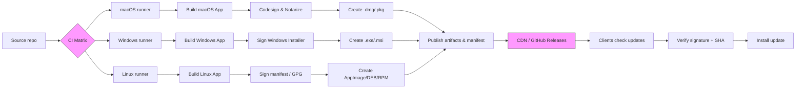

## Plan de création des binaires (macOS / Windows / Linux)

Résumé: plan concis pour compiler, signer, packager et publier des builds multiplateformes sécurisés.

Objectifs
- Produire artefacts natifs: `.dmg`/`.pkg` macOS, `.exe`/`.msi` Windows, AppImage/DEB/RPM pour Linux.
- Signer et vérifier les builds (security-first).
- Automatiser via CI (GitHub Actions) pour reproductibilité.
- Fournir update flow sécurisé (signature + manifeste).

Étapes principales
1. Préparer les runners CI:
   - macOS self-hosted ou GitHub-hosted macOS runner (pour codesign/notarize).
   - Windows runner (actions/runner/windows-latest).
   - Linux runner (ubuntu-latest).
2. Builder l'application:
   - Utiliser le toolchain du projet (Tauri/Rust + bundler frontend ou Electron) pour produire binaires pour chaque plateforme.
   - Générer artefacts distincts: full installer + delta patches.
3. Signer les artefacts:
   - macOS: `codesign` avec Developer ID Application, puis `notarytool` / altool notarize et `staple`.
   - Windows: signtool / osslsigncode pour signer `.exe`/`.msi` (certificat EV recommandé).
   - Linux: GPG sign or attach SHA256 and sign the manifest (no unified signing standard).
4. Packager:
   - macOS: créer `.dmg` (app contents + license), option `.pkg`.
   - Windows: créer installer MSI/NSIS exe.
   - Linux: créer AppImage (portable) + optional DEB/RPM for repos.
5. Publier artefacts sur CDN ou GitHub Releases; publier un manifeste JSON avec métadonnées, checksums et signatures.
6. Updater client:
   - Vérifie manifest signé, compare checksum, télécharge le binaire signé, vérifie signature avant installation.

CI / Automatisation (high level)
- Job matrix: macOS / Windows / Linux.
- Étapes CI: checkout → install deps → build → run tests → sign (using CI secrets) → package → upload artifact → publish release + notify.
- Secrets CI requis: signing certs (p12), Apple API key, code signing passwords, GPG private key (for manifest).

Sécurité et secrets
- Ne jamais committer clés privées; stocker dans `GH Actions Secrets` ou un Vault.
- Limiter accès aux secrets (restreindre qui peut déclencher release).
- Utiliser ephemeral runner ou keychain pour macOS signing lorsque possible.

Checklist rapide avant release
- Tests unitaires et e2e en CI passés.
- Artefact signé et checksum publié.
- Notarization macOS réussie.
- Manifest JSON généré et signé.
- Déploiement sur CDN/GitHub Releases terminé.

Exemple minimal de manifeste (manifest.json)
```
{
  "version": "1.2.3",
  "platform": "darwin-x64",
  "url": "https://cdn.example.com/finance-tracker/1.2.3/FinanceTracker-1.2.3.dmg",
  "sha256": "...",
  "signature": "..."
}
```

Diagramme pipeline (Mermaid)


Fichiers à préparer (suggestion)
- `.github/workflows/release.yml` — workflow matrix + signing steps.
- `scripts/build.sh` / `scripts/package.sh` — commandes unifiées pour build+package.
- `tools/notarize-macos.sh` — notarization helper (invoked in CI).
- `manifest/generate-manifest.js` — génère manifest JSON + signe.

Prochaines actions possibles
- Je peux générer un template `release.yml` GitHub Actions pour démarrer (requiert détails sur toolchain: Tauri ou Electron). Voulez-vous que je le fasse maintenant ?
