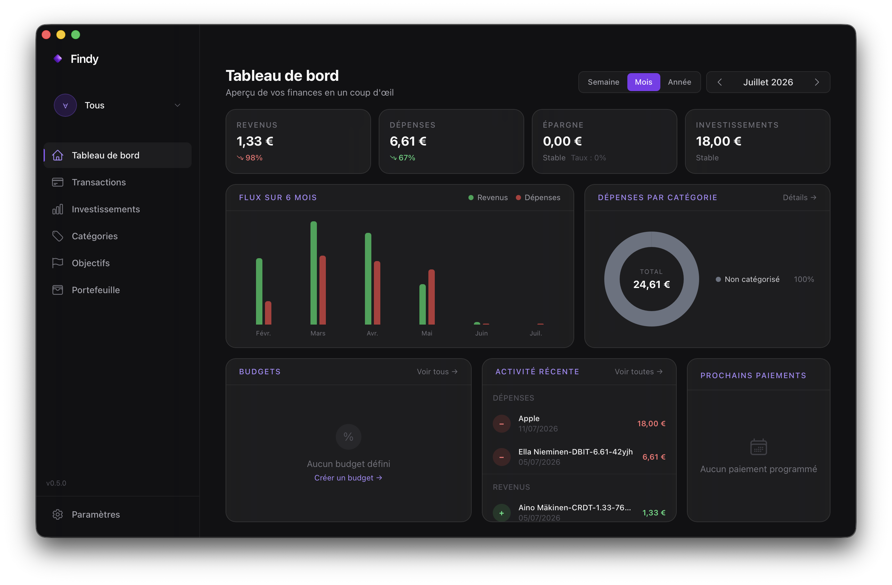
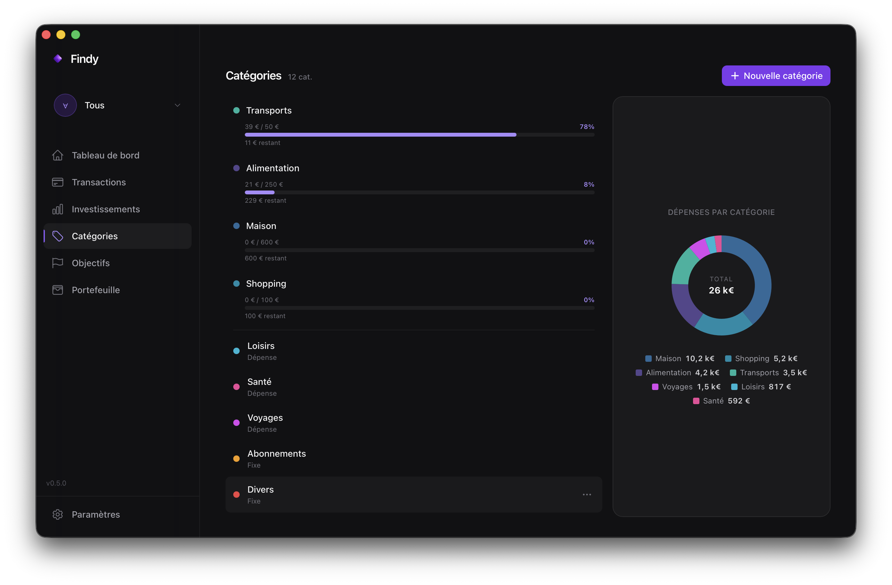

# Findy

### Vos finances, sans compromis.

Application de gestion financière personnelle.  
Locale, rapide, sans abonnement. Vos données ne quittent jamais votre machine.

  

       

---

  
    
  

---

## Ce que Findy change

**Oubliez les apps finance qui vendent vos données ou vous forcent dans un abonnement.**  
Findy tourne sur votre Mac. Tout est stocké localement. Vous contrôlez tout.

---

## Fonctionnalités

| | |
|:---:|---|
| 💳 | **Transactions** — Ajoutez, importez (CSV), recherchez. Tout est instantané. |
| 🏦 | **Banques** — Multi-comptes, IBAN, logos, soldes en direct. |
| 📊 | **Budgets** — Suivez vos dépenses par catégorie. Alertes de dépassement. |
| 📈 | **Investissements** — Crypto, Actions, ETF. Prix en temps réel. |
| 🔄 | **Récurrences** — Revenus et dépenses récurrents, générés automatiquement. |
| 🎯 | **Objectifs** — Définissez vos objectifs d'épargne, suivez la progression. |
| 👥 | **Tricount** — Dépenses partagées en couple, dettes et soldes clairs. |
| 🌐 | **Open Banking** — Sync bancaire PSD2 optionnelle. |
| 🌙 | **Dark mode** — Interface sombre, fluide, pensée pour les yeux. |

---

## Comment ça marche

**1.** Téléchargez l'app (macOS)  
**2.** Ajoutez vos comptes et vos transactions  
**3.** C'est tout. Pas de compte à créer, pas de cloud.

---

**Code source disponible.** Pas de tracking. Pas de pub. Juste vos finances.

Licence [Elastic License 2.0](LICENSE) — gratuit pour usage personnel, interdiction de redistribution en tant que service.

[Contribuer](CONTRIBUTING.md) · [Releases](https://github.com/avialleguerin/Findy/releases) · [Issues](https://github.com/avialleguerin/Findy/issues)

